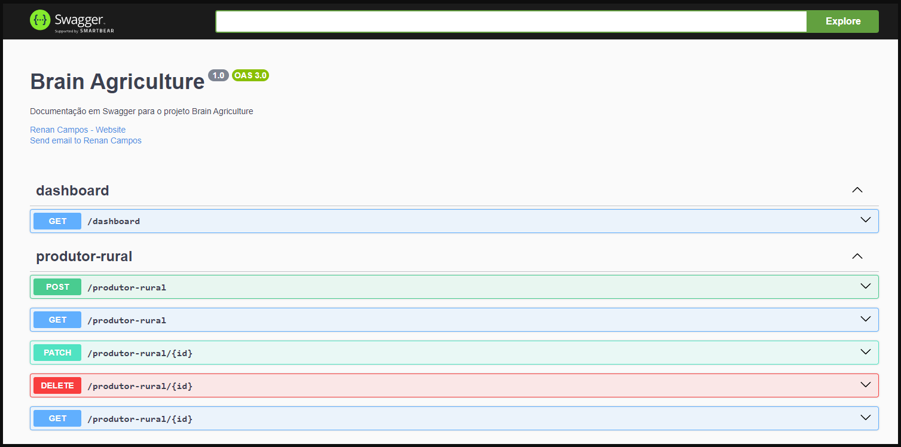

# 🧑🏼‍🌾 Produtor Rural

Cadastro de produtor rural, explorando:
 - NestJS
 - TypeORM
 - PostgreSQL
 - Swagger

### Features

 - Cadastro de Produtor Rural + Fazenda
 - Edição de Produtor Rural + Fazenda
 - Exclusão de Produtor Rural + Fazenda
 - Dashboard contendo informações gerais e dados prontos para gráficos de pizza
 - Validação de CPF / CPNJ
 - Validação de Área total em hectares
 - 5 Culturas disponíveis
 

# ⚒️ Instalação

## Clone
Clone a branch `main` do [repositório](https://github.com/ReenanCampos/brain-agriculture/tree/main), e utilize o VSCode para abrir o projeto.


## Configurações
Crie um arquivo .env seguindo o arquivo [.env.example](https://github.com/ReenanCampos/brain-agriculture/blob/main/.env.example) do projeto.

```
PORT = Porta localhost para aplicação ser executada
SWAGGER_THEME = Temas do swagger, opções: CLASSIC, DARK, DRACULA
DATABASE_HOST = host do banco
DATABASE_USER = usuario do banco
DATABASE_PASSWORD = senha do banco
DATABASE_PORT = porta do banco
DATABASE_NAME = nome da database

```

Crie/utilize um banco local Postgres, crie um database para o projeto `brain-agriculture`.

Aplique os valores correspondentes nas keys env `DATABASE_*`

## Executando

Abra o terminal (cmd) na pasta `...\brain-agriculture` e execute os seguintes comandos

Instalação de pacotes
```
yarn
```

Iniciar projeto
```
yarn start
```


### Extra

Comando para executar os testes
```
yarn run test
```


#  Documentação

Swagger - [http://localhost:3000/api](http://localhost:3000/api)




#  Postman

Utilize o arquivo [BrainAgriculture.postman_colletion.json](https://github.com/ReenanCampos/brain-agriculture/blob/main/postman/BrainAgriculture.postman_colletion.json) para importar uma coleção especifica para executar testes no projeto via postman.


# 💻 Contribuintes

 - Renan Campos (rere) | [LinkedIn](https://www.linkedin.com/in/reenan-campos/)


